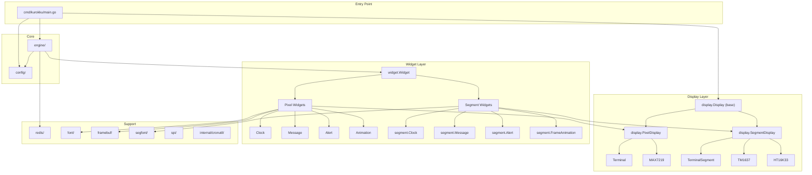
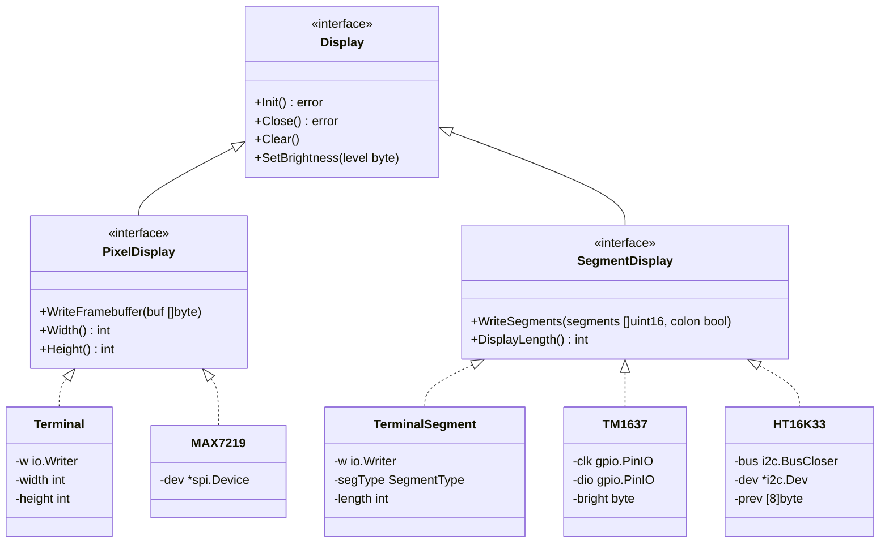
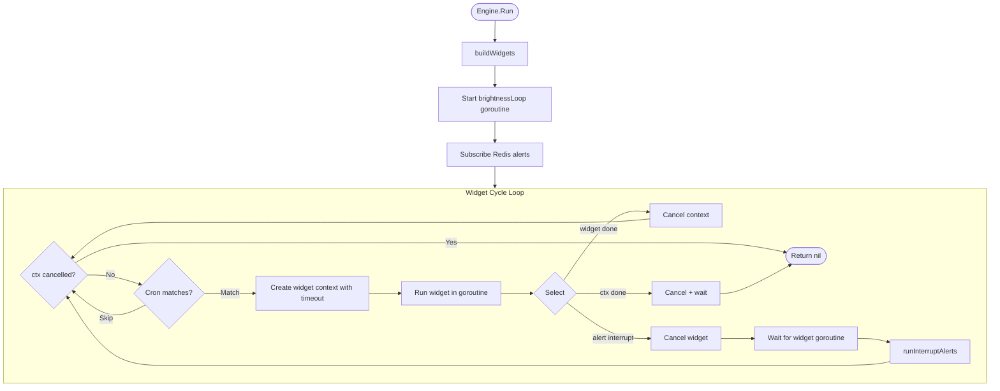
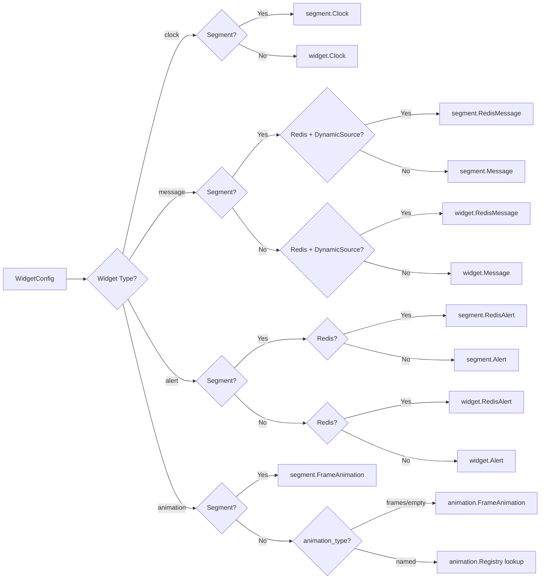
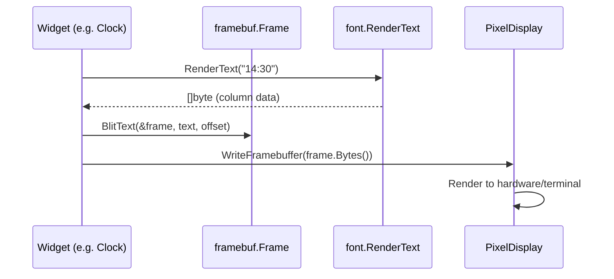
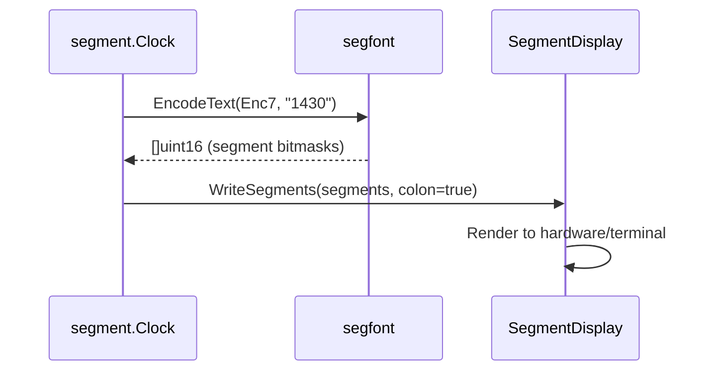
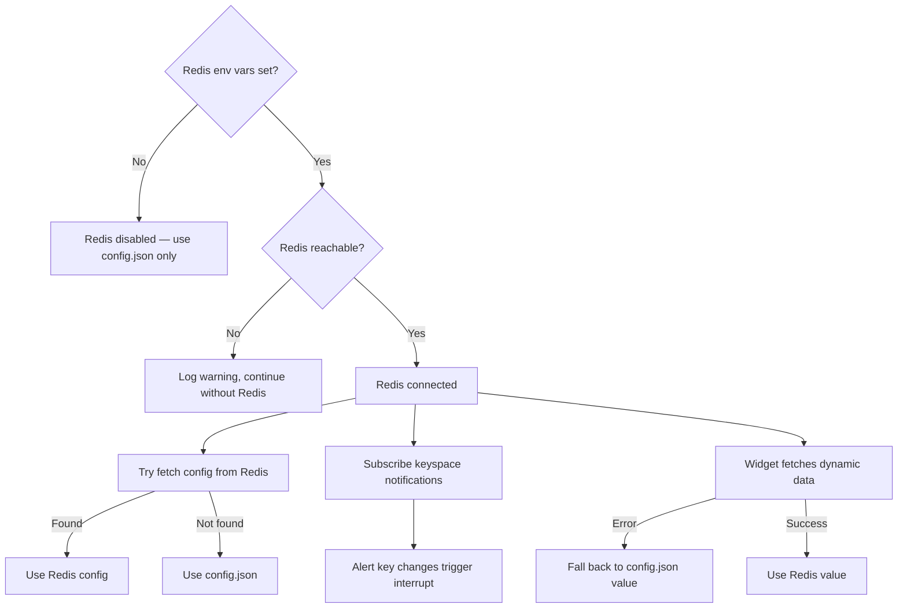
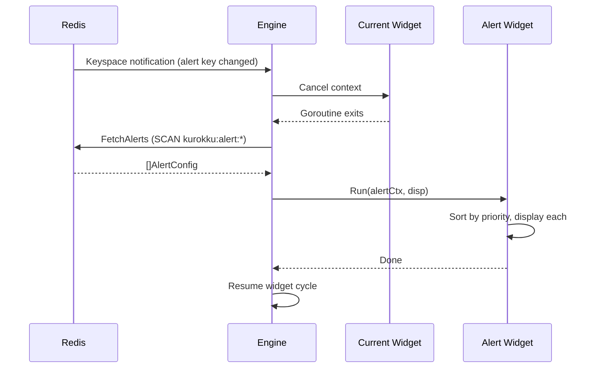
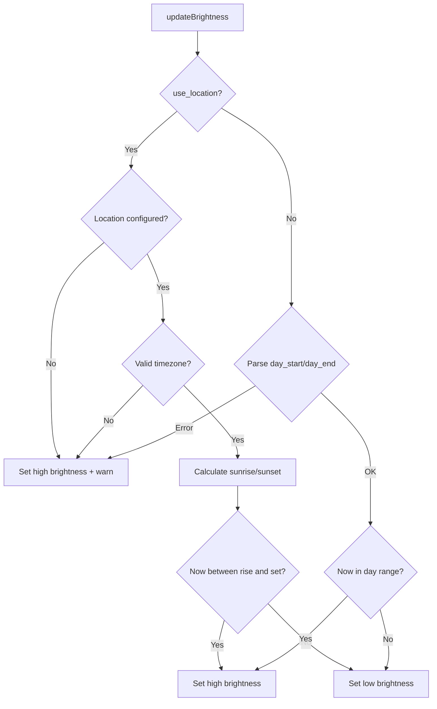

# Architecture

## High-Level Overview

LED Kurokku Go is a single binary that drives three types of LED displays from one widget-based engine. The architecture separates display concerns (how to render) from widget logic (what to render) through a layered interface hierarchy.



## Display Interface Hierarchy

The display system uses a slim base interface with specialized sub-interfaces. This allows the engine and widget infrastructure to work with any display type while widgets access the specific rendering methods they need via type assertion.



### Why Type Assertions?

Widgets receive `display.Display` (the base interface) in their `Run` method signature. This keeps the `Widget` interface uniform — all widgets share one `Run(ctx, disp)` signature regardless of which display type they target. Inside `Run`, each widget type-asserts to the sub-interface it needs:

```go
// Pixel widget
func (c *Clock) Run(ctx context.Context, disp display.Display) error {
    pd := disp.(display.PixelDisplay)
    // use pd.WriteFramebuffer(), pd.Width(), etc.
}

// Segment widget
func (c *segment.Clock) Run(ctx context.Context, disp display.Display) error {
    sd := disp.(display.SegmentDisplay)
    // use sd.WriteSegments(), sd.DisplayLength(), etc.
}
```

The engine guarantees the correct pairing: it checks `cfg.Display.IsSegment()` and constructs only the matching widget variant, so the type assertion never panics at runtime.

## Engine Flow

The engine is the central coordinator. It builds widgets from config, cycles through them, and handles Redis alert interrupts.



### Widget Building

The engine's `buildWidgets()` method branches on `cfg.Display.IsSegment()` for every widget type:



## Data Flow

### Pixel Rendering Path



### Segment Rendering Path



## Redis Integration

Redis is entirely optional. The system is designed for graceful degradation at every level.



### Alert Interrupt Sequence



## Brightness Control

The engine runs a background goroutine that adjusts brightness every 60 seconds.


