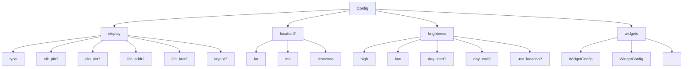

# Configuration Reference

The application is configured via a JSON file (default: `config.json`). All fields are documented here.

## Top-Level Structure

```json
{
  "display": { ... },
  "location": { ... },
  "brightness": { ... },
  "widgets": [ ... ]
}
```



## Display

| Field | Type | Required | Description |
|-------|------|----------|-------------|
| `type` | string | No | Display backend. Default: `terminal` (or CLI `-display` flag) |
| `clk_pin` | string | No | TM1637 GPIO clock pin. Default: `"GPIO23"` |
| `dio_pin` | string | No | TM1637 GPIO data pin. Default: `"GPIO24"` |
| `i2c_addr` | int | No | HT16K33 I2C address. Default: `0x70` (112) |
| `i2c_bus` | string | No | HT16K33 I2C bus name. Empty for default |
| `layout` | string | No | HT16K33 digit layout: `"sequential"` (default) or `"adafruit"` |

### Display Types

| Type | Category | Description |
|------|----------|-------------|
| `terminal` | Pixel | Terminal emulator using Unicode block characters |
| `max7219` | Pixel | MAX7219 4-in-1 LED matrix over SPI |
| `terminal_seg7` | Segment | Terminal emulator with 7-segment ASCII art |
| `terminal_seg14` | Segment | Terminal emulator with 14-segment ASCII art |
| `tm1637` | Segment | TM1637 4-digit 7-segment over GPIO |
| `ht16k33` | Segment | HT16K33 4-digit 14-segment over I2C |

The display type determines which widget variants the engine constructs (pixel or segment).

## Location (optional)

| Field | Type | Description |
|-------|------|-------------|
| `lat` | float | Latitude in decimal degrees |
| `lon` | float | Longitude in decimal degrees |
| `timezone` | string | IANA timezone name (e.g. `"America/Chicago"`) |

Used by `use_location` brightness mode to compute sunrise/sunset.

## Brightness

Brightness values are always specified in the **0-15 range**, regardless of display type. The driver maps to the hardware's native range automatically (e.g. TM1637 has 8 levels internally, so 0-15 is mapped to 0-7 via right-shift).

| Field | Type | Default | Description |
|-------|------|---------|-------------|
| `high` | int (0-15) | — | Brightness level during daytime |
| `low` | int (0-15) | — | Brightness level at nighttime |
| `day_start` | string | — | Start of bright period, `HH:MM` format |
| `day_end` | string | — | End of bright period, `HH:MM` format |
| `use_location` | bool | `false` | Use sunrise/sunset from `location` block |

**Priority:** `use_location` takes precedence over `day_start`/`day_end` when set to `true`.

**Fallback:** If `use_location` is true but location is missing or timezone is invalid, defaults to `high` brightness with a log warning.

## Widgets

Widgets are processed in array order. Each has a `type` and shared fields, plus type-specific fields.

### Shared Fields

| Field | Type | Default | Description |
|-------|------|---------|-------------|
| `type` | string | — | Widget type: `clock`, `message`, `alert`, `animation` |
| `enabled` | bool | — | Whether the widget is included in the cycle |
| `duration` | duration | — | Max run time. `"0s"` = no timeout (runs to completion) |
| `cron` | string | — | Optional cron expression. Widget skipped if it doesn't match |

### Clock Fields

| Field | Type | Default | Description |
|-------|------|---------|-------------|
| `format_24h` | bool | `true` | Use 24-hour format. When `false`, uses 12-hour with AM/PM blink pattern |

### Message Fields

| Field | Type | Default | Description |
|-------|------|---------|-------------|
| `text` | string | — | Display text. Fallback when `dynamic_source` is absent or unavailable |
| `dynamic_source` | string | — | Redis key for dynamic text override |
| `scroll_speed` | duration | `"50ms"` (pixel) / `"300ms"` (segment) | Time between scroll steps |
| `repeats` | int | `1` | Number of scroll cycles. `0` or negative = infinite |
| `sleep_between` | duration | `"0s"` | Pause between scroll repetitions |

### Alert Fields

| Field | Type | Default | Description |
|-------|------|---------|-------------|
| `scroll_speed` | duration | — | Scroll speed for alert messages |
| `alerts` | array | — | Fallback alert list (used when Redis is unavailable) |

#### Alert Entry

| Field | Type | Default | Description |
|-------|------|---------|-------------|
| `id` | string | — | Unique identifier |
| `message` | string | — | Alert text to display |
| `priority` | int | — | Lower = more urgent. Priority 10 is throttled to every 10 minutes |
| `display_duration` | duration | `"5s"` | How long to show this alert |
| `delete_after_display` | bool | `false` | Remove after showing |

### Animation Fields

| Field | Type | Default | Description |
|-------|------|---------|-------------|
| `animation_type` | string | `"frames"` | Pixel: `frames`, `rain`, `static`, `bounce`, `sine`, `scanner`, `life`. Segment: `rain`, `static`, `scanner`, `race`. |
| `frames` | array | — | Pixel frame data (32-byte arrays) |
| `segment_frames` | array | — | Segment frame data |
| `frame_duration` | duration | `"100ms"` | Default duration per frame |

#### Pixel Frame

| Field | Type | Description |
|-------|------|-------------|
| `data` | [32]byte | Column data, one byte per column |
| `duration` | duration | Per-frame override |

#### Segment Frame

| Field | Type | Description |
|-------|------|-------------|
| `data` | []uint16 | Segment bitmasks, one per digit |
| `colon` | bool | Whether to show the colon |
| `duration` | duration | Per-frame override |

## Duration Format

All duration fields use Go's `time.ParseDuration` format:

| Example | Meaning |
|---------|---------|
| `"50ms"` | 50 milliseconds |
| `"1s"` | 1 second |
| `"5s"` | 5 seconds |
| `"1m30s"` | 1 minute 30 seconds |
| `"0s"` | Zero (no timeout) |

## Example Configs

### Minimal Pixel

```json
{
  "brightness": { "high": 15, "low": 1, "day_start": "07:00", "day_end": "22:00" },
  "widgets": [
    { "type": "clock", "enabled": true, "duration": "0s" }
  ]
}
```

### Minimal 7-Segment

```json
{
  "display": { "type": "tm1637", "clk_pin": "GPIO23", "dio_pin": "GPIO24" },
  "brightness": { "high": 12, "low": 2, "day_start": "07:00", "day_end": "22:00" },
  "widgets": [
    { "type": "clock", "enabled": true, "duration": "0s", "format_24h": true }
  ]
}
```

### Full Featured

```json
{
  "display": { "type": "terminal" },
  "location": { "lat": 36.166, "lon": -86.784, "timezone": "America/Chicago" },
  "brightness": { "high": 12, "low": 2, "use_location": true },
  "widgets": [
    { "type": "clock", "enabled": true, "duration": "30s", "format_24h": false },
    {
      "type": "message", "enabled": true, "duration": "10s",
      "text": "Hello!", "scroll_speed": "50ms", "repeats": 2, "sleep_between": "1s"
    },
    {
      "type": "message", "enabled": true, "duration": "10s",
      "text": "--F", "dynamic_source": "kurokku:weather:temp:spring_hill"
    },
    {
      "type": "alert", "enabled": true, "duration": "30s", "scroll_speed": "50ms",
      "alerts": [
        { "id": "fallback", "message": "No alerts", "priority": 99, "display_duration": "3s" }
      ]
    },
    { "type": "animation", "enabled": true, "duration": "10s", "animation_type": "rain" },
    {
      "type": "message", "enabled": true, "duration": "10s",
      "text": "Lunch time!", "cron": "0 12 * * *"
    }
  ]
}
```
