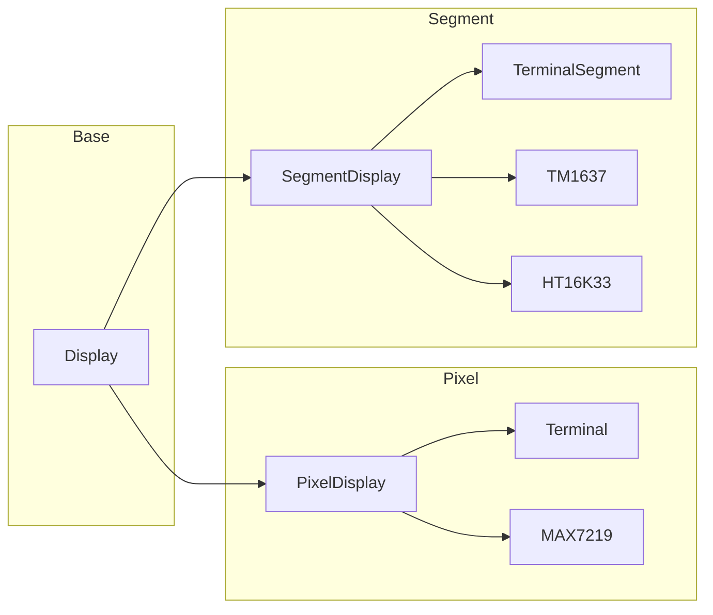
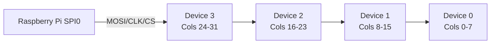
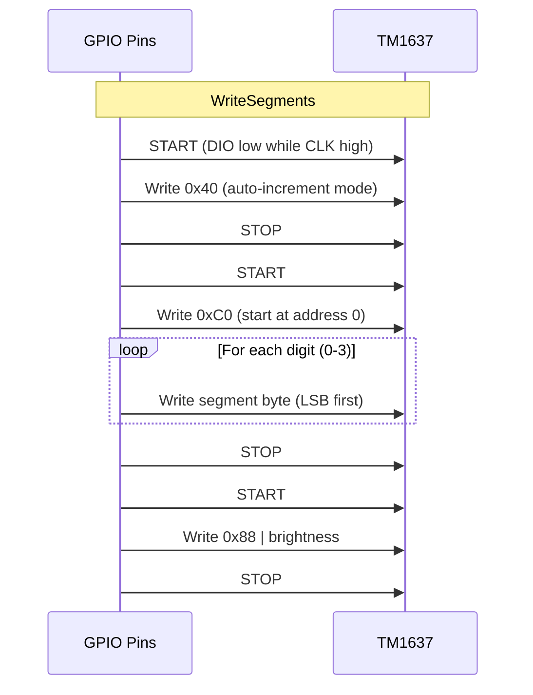
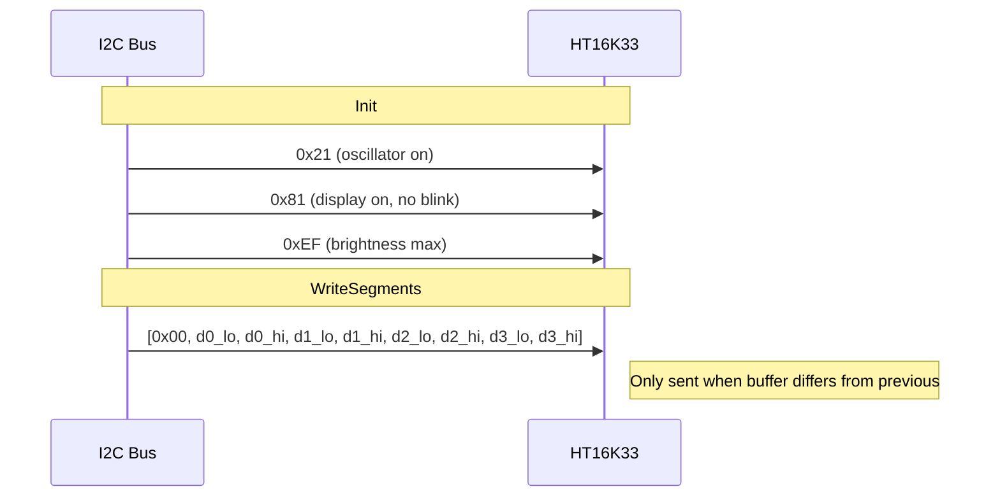

# Display Backends

This document covers the hardware and software details of each display backend.

## Interface Hierarchy

All displays implement the base `display.Display` interface. Depending on the hardware category, they additionally implement either `PixelDisplay` or `SegmentDisplay`.



## Pixel Displays

### Terminal (`display.Terminal`)

A virtual display that renders the 32x8 framebuffer to a terminal using block characters. Used for development and testing.

- **Output:** Unicode block characters (`█` for lit, space for off) inside a bordered frame
- **Redraw:** Uses ANSI escape `\033[H` (cursor home) for flicker-free in-place updates
- **Constructor:** `NewTerminal(w io.Writer)` — accepts any writer (stdout, buffer for tests)

Example output:
```
+--------------------------------+
|                                |
|  █ █ █   █ █     █ ██  █ █ █  |
|  █   █   █ █     █  █  █   █  |
|  █ █ █ █ █ █ █   █  █  █   █  |
|      █       █   █  █  █   █  |
|  █ █ █   █ █     █  █  █ █ █  |
|                                |
|                                |
+--------------------------------+
```

### MAX7219 (`display.MAX7219`)

Drives a 4-in-1 MAX7219 module (32x8 LED matrix) over SPI.

- **Protocol:** SPI at 10 MHz
- **Daisy chain:** 4 devices, device 0 is rightmost 8 columns
- **Framebuffer format:** 32 bytes, one per column, LSB = top row
- **Brightness:** 16 levels (register 0x0A, 0-15)
- **Init sequence:** Display test off → No BCD decode → Scan all 8 rows → Normal operation → Set brightness



Each `WriteFramebuffer` call sends 8 SPI transactions (one per row). Each transaction is 8 bytes (2 per device × 4 devices) carrying the row register and data.

## Segment Displays

### Segment Encoding

Segment displays use `uint16` bitmasks to represent each character. Two encodings are supported:

**7-Segment (TM1637)** — uses only the low byte:

```
 _a_
|   |
f   b
|_g_|
|   |
e   c
|_d_|

bit 0=a, 1=b, 2=c, 3=d, 4=e, 5=f, 6=g
```

**14-Segment (HT16K33)** — uses full uint16:

```
  _a1_ _a2_
 |\   |   /|
 f h  j  k b
 |  \ | /  |
  _g1_ _g2_
 |  / | \  |
 e n  m  l c
 |/   |   \|
  _d1_ _d2_

bits: a1=0, a2=1, b=2, c=3, d1=4, d2=5, e=6, f=7,
      g1=8, g2=9, h=10, j=11, k=12, l=13, m=14, n=15
```

The `segfont` package provides lookup maps (`Seg7`, `Seg14`) and encoder functions (`Enc7`, `Enc14`). The engine automatically selects the correct encoder based on the display type.

### TerminalSegment (`display.TerminalSegment`)

ASCII art rendering of segment displays for development. Supports both 7-segment (5-line) and 14-segment (7-line) output.

- **Constructor:** `NewTerminalSegment(w io.Writer, segType SegmentType)`
- **Colon:** Rendered as `o` characters between digits 1 and 2

7-segment example (`terminal_seg7`):
```
+-------------------------+
| ___       ___  ___ |
||   |    ||   ||   ||
||___|    ||___||___||
||   |    |    ||   ||
||___|    | ___||___||
+-------------------------+
```

14-segment example (`terminal_seg14`):
```
+-------------------------------+
| __ __  __ __  __ __  __ __ |
||\ | /||\ | /||\ | /||\ | /||
|| \|/ || \|/ || \|/ || \|/ ||
| __ __  __ __  __ __  __ __ |
|| /|\ || /|\ || /|\ || /|\ ||
||/ | \||/ | \||/ | \||/ | \||
| __ __  __ __  __ __  __ __ |
+-------------------------------+
```

### TM1637 (`display.TM1637`)

Drives a 4-digit 7-segment display via GPIO bit-bang protocol.

- **Protocol:** Custom two-wire serial (not I2C), bit-banged via GPIO
- **Signals:** CLK (clock) + DIO (data)
- **Data format:** Low byte of each `uint16` segment value
- **Colon:** Bit 7 OR'd onto digit 1's byte
- **Brightness:** 8 levels (0-7), mapped from the 0-15 range by right-shifting



### HT16K33 (`display.HT16K33`)

Drives a 4-digit 14-segment display over I2C.

- **Protocol:** Standard I2C
- **Address:** Default `0x70`, configurable via solder jumpers (up to `0x77`)
- **Data format:** 4 × little-endian `uint16` in an 8-byte buffer
- **Colon:** Bit 14 (`0x4000`) OR'd onto digit 1's uint16
- **Brightness:** 16 levels (0-15) via brightness register `0xE0 | level`
- **Optimization:** Differential updating — only writes when buffer has changed
- **Layouts:** Sequential (digits 0-3 map to buffer positions 0-3) or Adafruit (skips position 2 for colon)



#### Layout Modes

The HT16K33 supports two physical wiring layouts:

| Mode | Buffer Position 0 | 1 | 2 | 3 |
|------|-------------------|---|---|---|
| `sequential` | Digit 0 | Digit 1 | Digit 2 | Digit 3 |
| `adafruit` | Digit 0 | Digit 1 | *(colon)* | Digit 2 |

The Adafruit layout is used by the Adafruit 14-segment LED backpack where the colon occupies a dedicated buffer position.
