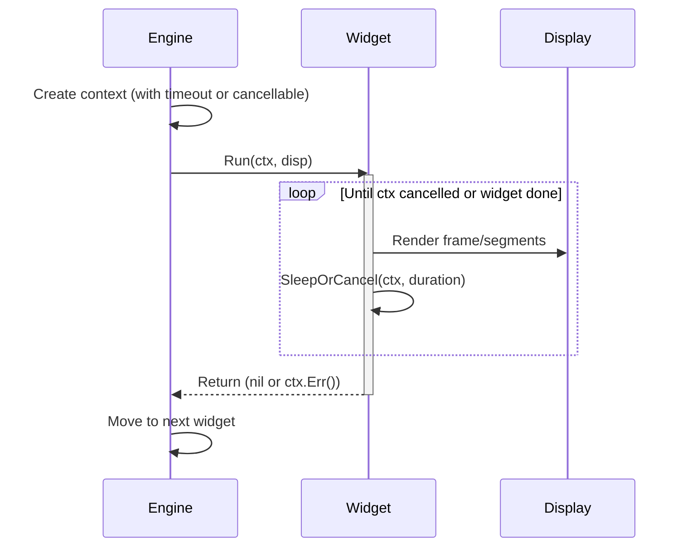
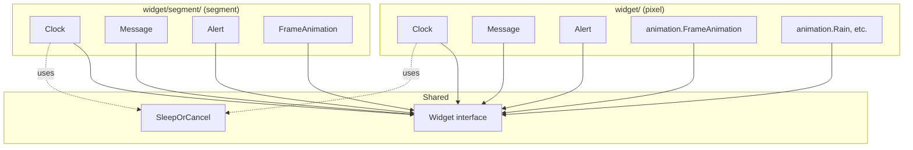
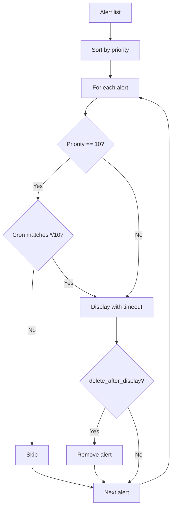

# Widgets

Widgets are the core display units. Each widget implements a simple interface and is responsible for rendering content to the display for some duration.

## Widget Interface

```go
type Widget interface {
    Name() string
    Run(ctx context.Context, disp display.Display) error
}
```

- `Name()` returns a human-readable identifier for logging
- `Run()` drives the display until the context is cancelled or the widget completes naturally
- The `disp` parameter is the base `display.Display` — widgets type-assert to the sub-interface they need

## Widget Lifecycle



## Pixel vs Segment Variants

Every widget type has both a pixel and a segment implementation. The engine selects the correct variant based on `config.Display.IsSegment()`.



## Clock

Displays the current time with a blinking colon.

### Behavior

| Mode | Blink Pattern |
|------|---------------|
| 24-hour | 500ms colon on, 500ms colon off |
| 12-hour AM | Same as 24-hour |
| 12-hour PM | Double blink: 150ms on, 200ms off, 150ms on, 500ms off |

### Pixel Clock

Renders time as text using the 5x7 bitmap font, centered on the 32-pixel-wide display. The colon alternates between `:` and ` ` in the text string.

- Leading zero for 24h and for 12h when hour >= 10
- Single-digit hour in 12h mode uses no leading zero

### Segment Clock

Encodes hour and minute digits as segment bitmasks. Colon is a separate boolean passed to `WriteSegments`.

- Leading blank (space) for single-digit 12h hours
- 4 digits: `HH` `MM` (e.g. `14:30` → segments for `1`, `4`, `3`, `0`)

### Configuration

```json
{
  "type": "clock",
  "enabled": true,
  "duration": "30s",
  "format_24h": true
}
```

### Time Injection

Both clock variants have a `NowFunc func() time.Time` field for testing. When `nil`, they use `time.Now()`.

## Message

Displays static or scrolling text.

### Behavior

| Condition | Pixel | Segment |
|-----------|-------|---------|
| Text fits display | Centered, hold until context done | Centered with blank padding, hold |
| Text too wide | Scroll with padding on both sides | Character-by-character scroll with padding |
| Default scroll speed | 50ms per pixel | 300ms per character |

### Scrolling Algorithm

**Pixel:** Render text to column data via font, pad with `displayWidth` blank columns on each side, slide a window across.

**Segment:** Encode text to segment array, pad with `displayLength` zero entries on each side, slide a window across.

Both support `repeats` (number of full scroll cycles; ≤0 means infinite) and `sleepBetween` (pause between repetitions).

### Configuration

```json
{
  "type": "message",
  "enabled": true,
  "duration": "10s",
  "text": "Hello World!",
  "scroll_speed": "50ms",
  "repeats": 2,
  "sleep_between": "1s"
}
```

### Dynamic Source (Redis)

When `dynamic_source` is set and Redis is connected, `RedisMessage` (or `segment.RedisMessage`) fetches text from the specified Redis key on each run. Falls back to the `text` field on error or key absence.

```json
{
  "type": "message",
  "enabled": true,
  "duration": "10s",
  "text": "--F",
  "dynamic_source": "kurokku:weather:temp:spring_hill"
}
```

## Alert

Displays prioritized alert messages.

### Behavior

1. Sort alerts by `priority` (lower number = higher urgency), stable within same priority
2. Skip priority-10 alerts unless current time matches `*/10 * * * *` (every 10 minutes)
3. For each alert: create sub-context with `display_duration` timeout, display as scrolling message
4. If `delete_after_display` is true: call `OnDelete` callback (Redis) or remove from local slice

### Alert Sorting and Display



### Redis Alerts

`RedisAlert` (and `segment.RedisAlert`) fetches alerts from Redis (`SCAN kurokku:alert:*`) on each `Run`. Falls back to the `alerts` config array on error. Alert deletions are forwarded to Redis via `DeleteAlert`.

### Configuration

```json
{
  "type": "alert",
  "enabled": true,
  "duration": "30s",
  "scroll_speed": "50ms",
  "alerts": [
    {
      "id": "fallback",
      "message": "No alerts",
      "priority": 99,
      "display_duration": "3s",
      "delete_after_display": false
    }
  ]
}
```

## Animation

### Pixel Animations

**Frame-based:** Plays a list of pre-defined 32x8 frames in a loop. Each frame can have its own duration, falling back to the widget's `frame_duration`, then to 100ms.

**Procedural:** Built-in animations registered in `animation.Registry`:

| Name | Description | Frame Rate |
|------|-------------|------------|
| `rain` | Raindrops falling with 3-pixel trails | 80ms |
| `random` | TV-static random noise | 50ms |
| `bounce` | Pixel bouncing with 2-pixel trail | 50ms |
| `sine` | Scrolling sine wave (one pixel per column) | 50ms |
| `scanner` | KITT-style sweeping column with fading trail | 40ms |
| `life` | Conway's Game of Life with toroidal wrapping, auto-reseed on stagnation | 150ms |

### Segment Animations

Frame-based only. Each frame specifies segment data (`[]uint16`), colon state, and optional duration.

```json
{
  "type": "animation",
  "enabled": true,
  "duration": "10s",
  "segment_frames": [
    { "data": [63, 6, 91, 79], "colon": true, "duration": "500ms" },
    { "data": [63, 6, 91, 79], "colon": false, "duration": "500ms" }
  ]
}
```

### Configuration (Pixel)

```json
{
  "type": "animation",
  "enabled": true,
  "duration": "10s",
  "animation_type": "rain"
}
```

## Cron Scheduling

Any widget can include a `cron` field. The engine evaluates the expression against the current time before running the widget. If it doesn't match, the widget is skipped for this cycle.

```json
{
  "type": "message",
  "enabled": true,
  "duration": "10s",
  "text": "Lunch time!",
  "cron": "0 12 * * *"
}
```

Uses standard 5-field cron syntax (minute, hour, day-of-month, month, day-of-week). Implemented via `robfig/cron/v3`.
